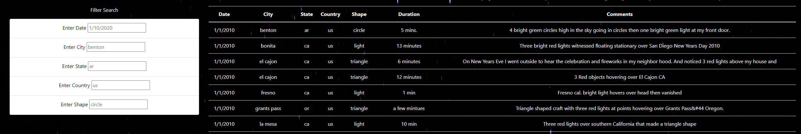
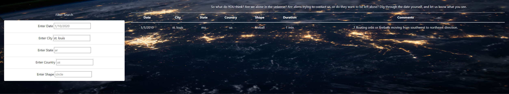
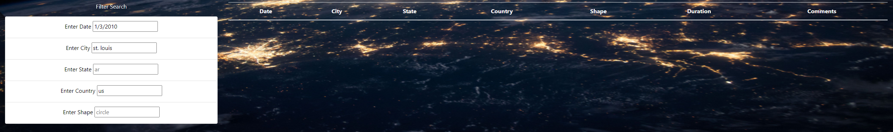

# UFOs

## Overview

This analysis is to allow esay filtering of UFO Sightings based on one or multiple criteria. These filters include date, city, state, country, and the general shape.

## Results

The baseline of the webpage has example filter queries as shown in the photo below.

When no filters are being used all of the data will be shown. To use the filters, someone will type in all lowercase (case sensitive inputs due to data) whatever data they want to filter. In the example image below the data is being filtered solely by the city "st. louis."

To further along this example, multiple filters can be applied, such as: Date, city, and country. In the example below there is no sighting that fits all 3 criteria, so the data rows are empty.

## UFOs Analysis Summary

One drawback of this current design is that the data needs to be case sensitive to all lowercase. This can feel unintuitive for many users that may make it feel strange to use. An simple solution could be to have dropdown filters available for each of the criteria and a search bar at the top of the filters. This would help in showing all the relevant cities, as well as reducing user error from typos. An additional recommendation would be to be able to sort the data by clicking on a column header, which is an intuitive function for many data displays.
